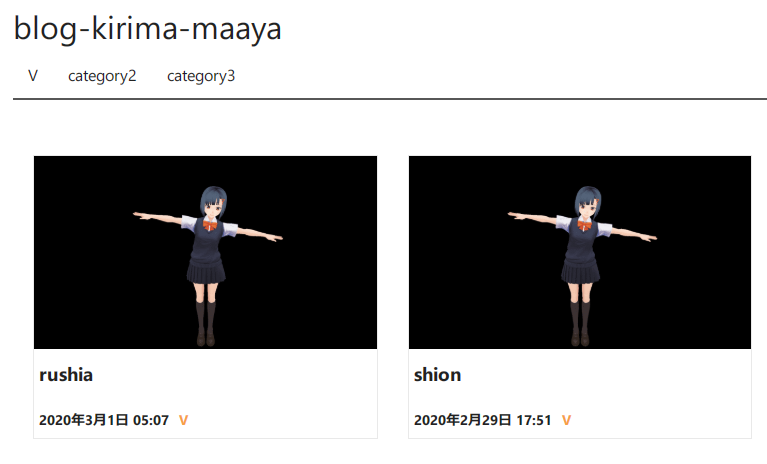

前回のブログ選定で**Gatsuby + Netlify**にしようと決めたCHIKI。しかしここから三山ほどあったのでした…

##ブログの雛形探し
まずGatsbyのblog雛形を探します。   
`gatsby`で検索すると男性用化粧品などがヒットしてしまうので、
`gatsbyjs ブログ`などで検索します。するとGatsbyのスターターライブラリや↓

<div class="iframely-embed"><div class="iframely-responsive" style="height: 140px; padding-bottom: 0;"><a href="https://www.gatsbyjs.com/starters/" data-iframely-url="//cdn.iframe.ly/srKD0dV?card=small"> </a></div></div>

中の[スターターブログ](https://github.com/gatsbyjs/gatsby-starter-blog)や[それのCSSを省いたもの](https://github.com/noahg/gatsby-starter-blog-no-styles)
、定番の[gatsby-starter-lumen](https://github.com/alxshelepenok/gatsby-starter-lumen)などが見つかります。
その中で、lumenを改造した[blog-kirima-maaya](https://github.com/yosipy/blog-kirima-maaya)を使わせてもらうことにしました。([開発者の方のページ](http://codelabo.com/posts/20200329145358))

##ブログの立ち上げそしてエラー
CHIKIの環境のOSは**Windows10(64bit)**です。これにソフトをインストールしていきます。

###Node.js、Gatsby、雛形のインストールとエラー＆対処法
Gatsbyはnode.jsが必要なので、
[ここ](https://nodejs.org/ja/)から最新版(2021/01/01時点で**16.13.1**)のインストーラをダウンロードし、
インストールします。
  
続いてコマンドプロンプト上で
```bash
npm install -g gatsby-cli
```
とコマンドをうつことでGatsbyが使えるようになります。
(なお[公式サイト](https://www.gatsbyjs.com/)のコマンド`npm init gatsby`だと、
プロジェクト(あるフォルダ)でのみGatsbyが有効になるそうです)  

最後に、GitHubのReadme.mdにあるように、適当なフォルダで
```bash
gatsby new blog https://github.com/yosipy/blog-kirima-maaya
```
とコマンドを入力すれば、`blog`というフォルダにブログのフォルダが構成されるはずなのですが…
```bash
npm ERR! code 1
npm ERR! path (フォルダパス)
npm ERR! command failed
npm ERR! command C:\WINDOWS\system32\cmd.exe /d /s /c (node install/libvips && node install/dll-copy && prebuild-install) || (node-gyp rebuild && node install/dll-copy)
...
npm ERR! A complete log of this run can be found in:

```
エラーが出た。なんでや。  
いろいろ調べた結果、Gatsbyは最新のNode.jsには対応していないようで、
[Gatsy公式によると、Node.jsのバージョンは14じゃないとだめらしい](https://www.gatsbyjs.com/docs/upgrading-node-js/#upgrading-from-nodejs-version-10)。  
いったんNode.jsをアンインストールし、[ここからNode.js 14.18.2をダウンロードして](https://nodejs.org/ja/download/releases/)インストールします。

###node-gypエラーと対処法
すると…Gatsbyとブログ用ファイルのインストールはうまくいったのですが、次はnode-gypというエラーが発生しました…
```
gyp ERR! configure error
gyp ERR! stack Error: Command failed: C:\Users\chiki\AppData\Local\Programs\Python\Python310\python.EXE -c import sys; print "%s.%s.%s" % sys.version_info[:3];
gyp ERR! stack   File "<string>", line 1

```
調べてみると[node-gyp](https://github.com/nodejs/node-gyp)というのはNode.jsからC++やpythonのプログラムを使えるようにするものらしいです。
なので各OS用のC++とpython(2.7推奨)をインストールしてパスを教えてあげないといけないそうです。  
Windows10の場合は[windows-build-tools](https://github.com/felixrieseberg/windows-build-tools)というのがあり、
**管理者権限の**コマンドプロンプトで
```
npm install --global windows-build-tools
```
と打てばよいらしい。早速やってみますが…

###windows-build-toolsのエラーと対処法
windows-build-toolsのインストール途中で、以下のメッセージが出て止まってしまいました。
```
Starting installation...
Launched installers, now waiting for them to finish.
This will likely take some time - please be patient!

Status from the installers:
---------- Visual Studio Build Tools ----------
Still waiting for installer log file...
------------------- Python --------------------
Successfully installed Python 2.7
```
`Ctrl-C`で一旦停止させます。  
同様のエラーを取り上げてくださっている↓のブログを参考にしました。
<div class="iframely-embed"><div class="iframely-responsive" style="height: 140px; padding-bottom: 0;"><a href="https://moewe-net.com/nodejs/not-completed-windows-build-tools" data-iframely-url="//cdn.iframe.ly/mPoxkRQ"> </a></div></div>

この時点でC++(Visual Studio)とpythonはインストールは完了しているということなのでpythonのフォルダの存在を確認します。  
`C:\Users\<ユーザー名>\.windows-build-tools\python27`に`python.exe`ファイルがあることを確認します。その後コマンドプロンプトで
```
npm config list
```
と入力すると、node.jsの設定値が読み出せます。その中の`userconfig`のところで
```
; userconfig C:\Users\<ユーザー名>\.npmrc
msbuild_path = "C:\\Program Files (x86)\\Microsoft Visual Studio\\2019\\Community\\MSBuild\\Current\\Bin\\MSBuild.exe"
msvs_version = "2017"
python = "C:\\Users\\<ユーザー名>\\.windows-build-tools\\python27\\python.exe"
```
と設定してあればOKです。(2022年1月現在のmsvs_versionは2017)。   
もしpythonのパスやmsvsのバージョンが間違っていたら、`C:\Users\<ユーザー名>\.npmrc`のファイルを直接修正してしまうのが早いと思います。
(私の場合は先にpython3をインストールしてしまったので競合して停止してしまったのだと思います…多分)   

ここまで設定・インストールした上で、コマンドプロンプトで
```
npm i -g node-gyp
```
と入力してnode-gypをインストールした後、再度ブログファイルをインストールし直した上で、
```
gatsby develop
```
と入力すると無事developモードが起動し、`http://localhost:8000/`にアクセスすると作成中ブログにアクセスすることができました。↓
 

###番外編　nvm-windowsの実行エラー
Windows上でNode.jsのバージョンダウンする時、そのままインストールするのではなく、[nvm-windows(Node.jsのバージョン切り替えツール)](https://github.com/coreybutler/nvm-windows#node-version-manager-nvm-for-windows)
を使うほうがいいと思います。
[こちら](https://docs.microsoft.com/ja-jp/windows/dev-environment/javascript/nodejs-on-windows)にマイクロソフト公式の案内があるので、
これにしたがって、すでにインストールしたNode.jsを一度アンインストールした上で**nvm-setup.exe**をインストールして、

```
nvm install 14.18.2
```
でnode.jsバージョン14.18.2をインストールし、続いて`nvm use 14.18.2`でセットできるはずが…
 
またしてもエラー、しかも文字化け…   
調べてみると**管理者権限で実行**することで無事切り替えができるようになりました。↓
 

##結果思ったこと
「Windows10でNode.jsとかGatsbyとか動かすの大変だなぁ。いっそlinuxの方が簡単かなぁ？」と思い、
[WSL2](https://docs.microsoft.com/ja-jp/windows/wsl/install)でGatsbyを動かそうとしてまたしてもエラーを発生させてしまったのは次のお話…
